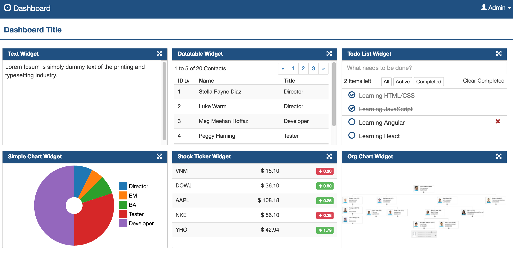
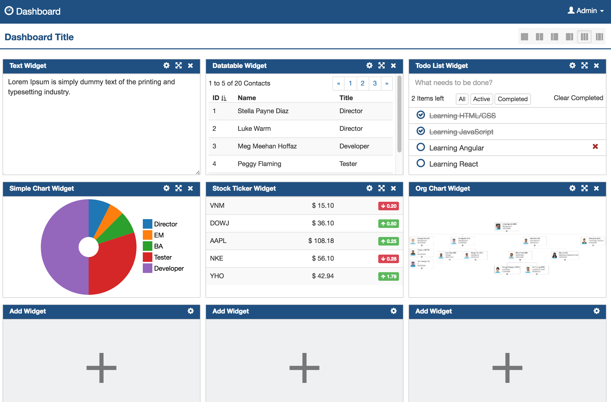
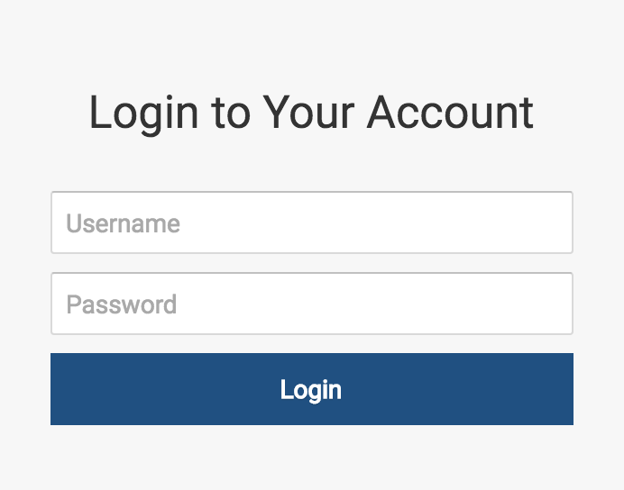
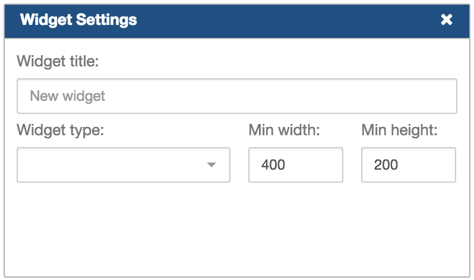
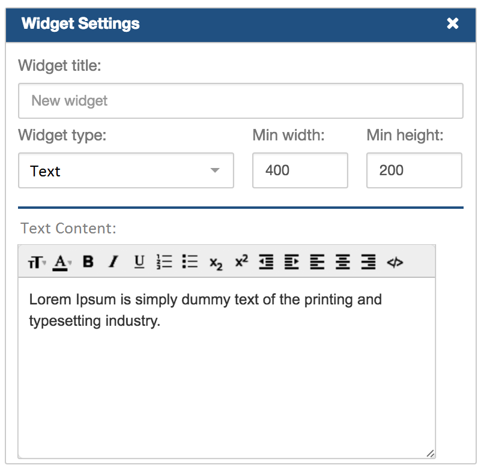
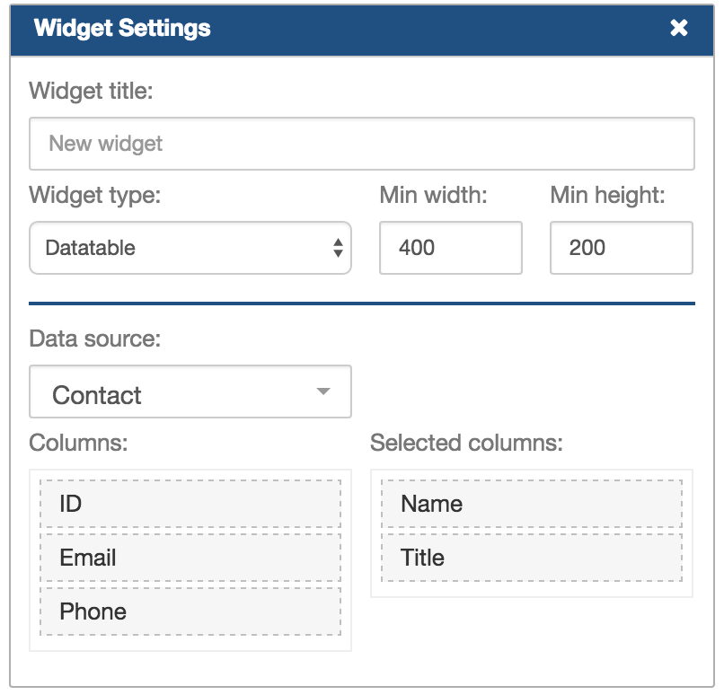
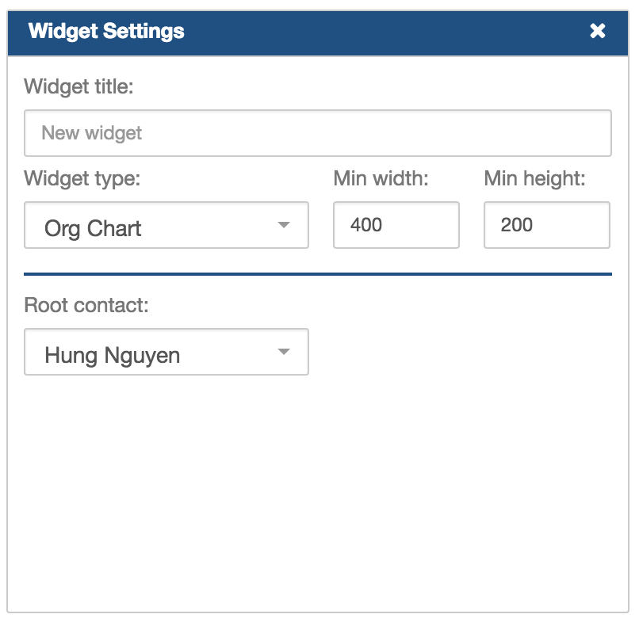
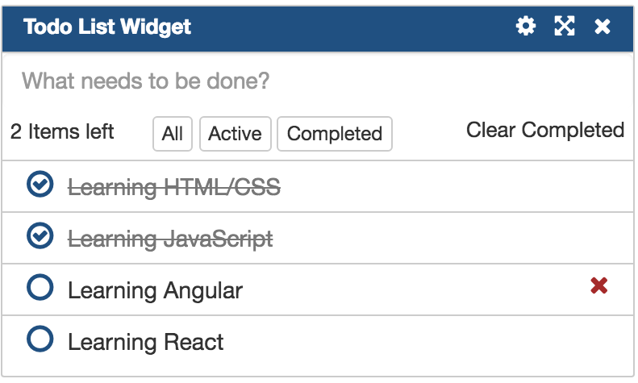
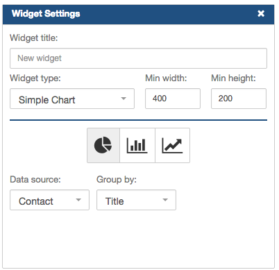
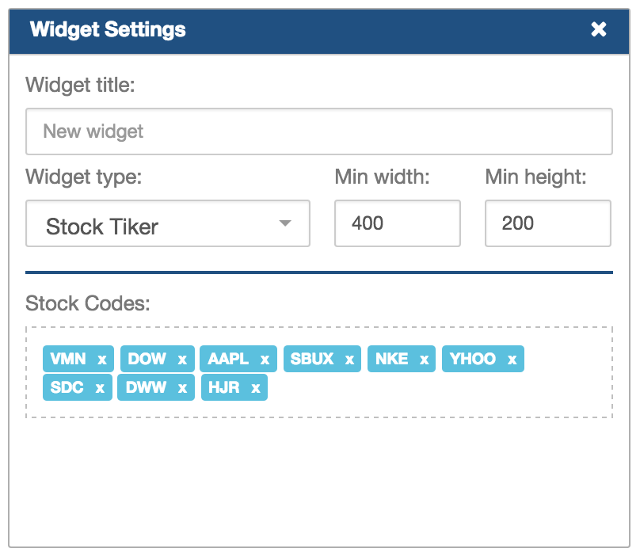

# JavaScript Framework Assignment

### 1. React/Redux
**Frameworks & Lib**:

 - React: https://facebook.github.io/react/
 - Redux: http://redux.js.org/

**Coding Convention and Best Practices**:

- https://github.com/airbnb/javascript/blob/master/react/README.md

## 2. Tasks
### 2.1 Overview

**Dashboard** is a web application that helps user mange their dashboards. From the dashboard page, they can choose layout and add desired widgets that are supported by the system.
 **View Mode**

 **Edit Mode**

### 2.2 Features

#### Login/ Logout Page

#### Dasboard Page
- Render page with selected layout and widgets
- Switch View & Edit mode
- Edit mode:
  - Change layout
  - Show widgets in Edit mode
  - Drag & Drop to re-arrange widget location on the dashboard
  - 'Add widget' button in each column of selected layout
- View mode:
  - Show widgets in View mode

#### Widget Component
- There are many different widget types but the required widget types are: Text, Datatable, OrgChart, TodoList
- Widget common feature:
  - Expand & Restore zoom
  - Widget content
  - Edit mode:
    - Delete widget button
    - Widget settings: Widget type, widget properties
    

- Text widget:
  - Content: Display HTML content (readonly)
  - Setting: integrate a Markdown editor with WYSIWYG support
  

- Datatable widget:
  - Content: Display data-table, sort columns and filter data at client-side
  - Setting: Data source (Contact,...) and data properties for data-table columns
  

- OrgChart widget:
  - Utilize codebase from 'JavaScript Fundamentals' assignment, data loads from server-side
  - Content: Read-only organization chart
  - Setting: set a Contact as 'root'
  

- TodoList widget:
  - Content: Create, toggle completion, delete item, list and filter items. Data load from server-side
  - Setting: none 
  

- SimpleChart widget (bonus):
  - Content: display a chart in type of Line, Column, Pie
  - Setting: Chart type (line, column, pie), Data source (Contact,...), Data property for x-axis and y-axis
  

- StockTicker widget (bonus):
  - Content: Stock Ticker watchlist by using websocket technique
  - Setting: Stock codes
  

### 2.3 Resources and Initial Code
| **React** |
| --- |
|https://github.com/vu159951/front-end-react-redux|
**REST-APIs:** https://github.com/vu159951/backend-nodejs

**Good luck and enjoy coding!**
